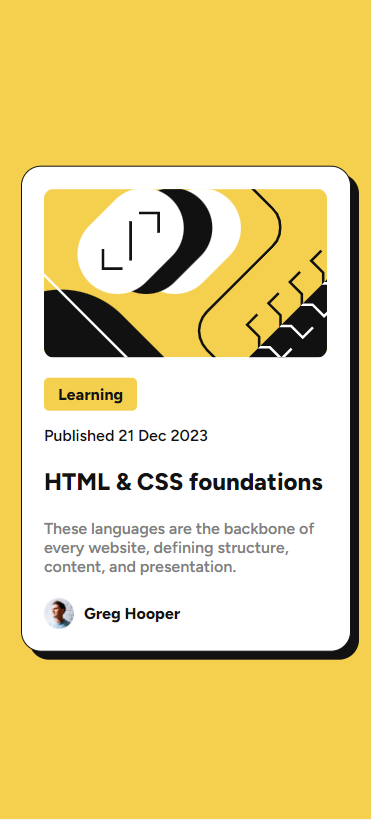
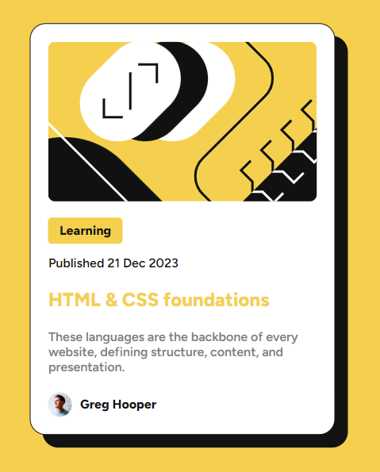

# Frontend Mentor - Blog preview card

This is a solution to the [Blog preview card challenge on Frontend Mentor](https://www.frontendmentor.io/challenges/blog-preview-card-ckPaj01IcS).
Frontend Mentor challenges help you improve your coding skills by building realistic projects. 

## Table of contents

- [Overview](#overview)
  - [Screenshot](#screenshot)
  - [Links](#links)
- [My process](#my-process)
  - [Built with](#built-with)
- [Author](#author)

## Overview

### Screenshots

 This is the desktop view.

 This is the mobile view.

 This are the two hover effects that a user could see when the pointer of the mouse is on the title of the card.

### Links

- Solution URL: [https://github.com/totarochristian/blog-preview-card](https://github.com/totarochristian/blog-preview-card)
- Live Site URL: [https://blog-preview-card-psi-lilac.vercel.app/](https://blog-preview-card-psi-lilac.vercel.app/)

## My process

### Built with

- Semantic HTML5 markup
- CSS custom properties

## Author

- GitHub - [@totarochristian](https://github.com/totarochristian)
- Frontend Mentor - [@totarochristian](https://www.frontendmentor.io/profile/totarochristian)
- Linkedin [Christian Totaro](https://www.linkedin.com/in/christian-totaro-080a7018a/)